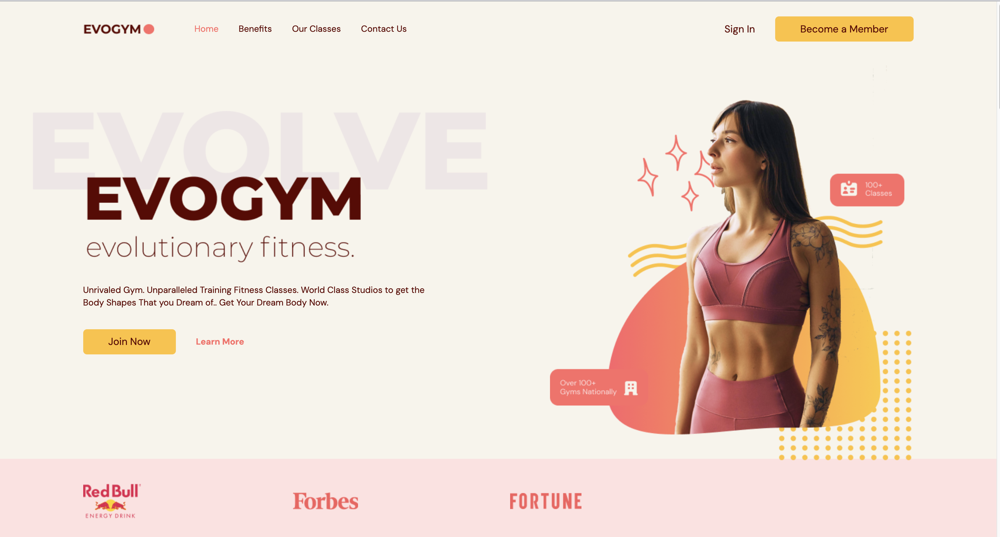
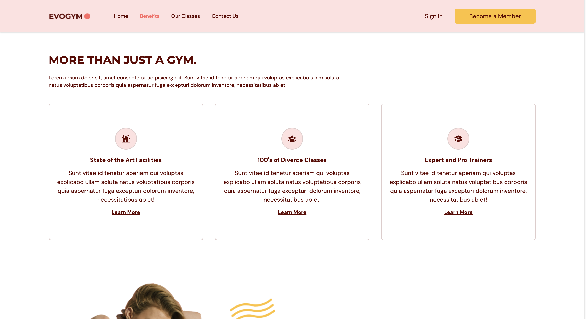
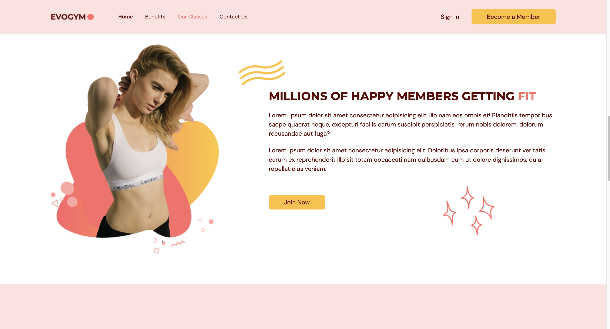
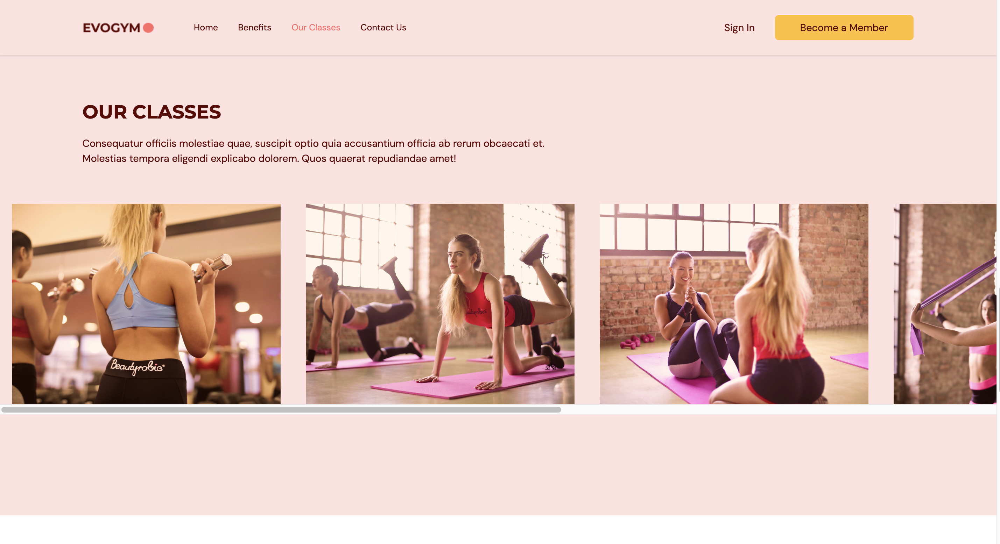
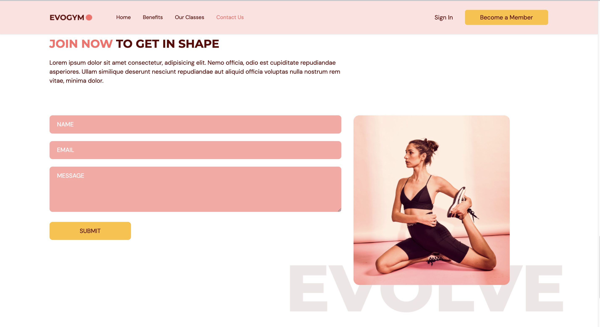
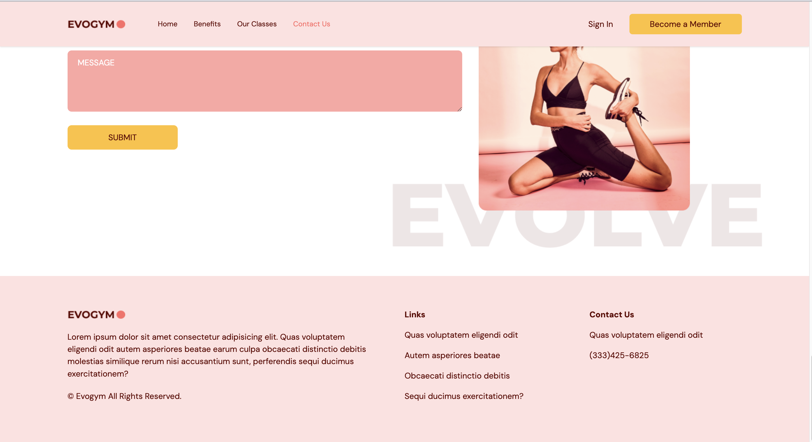
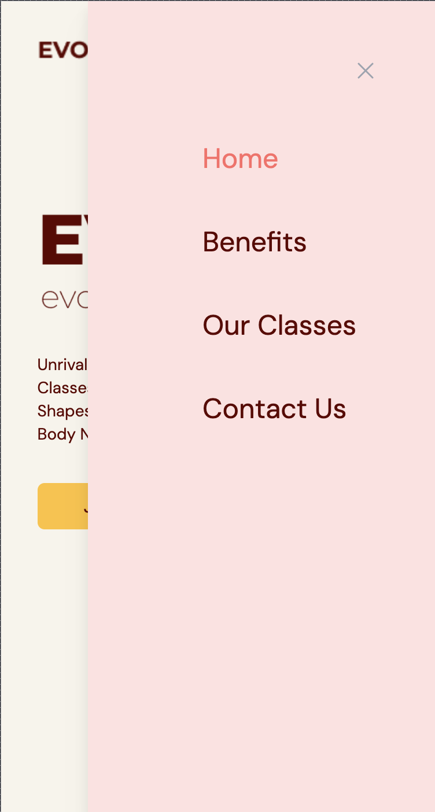
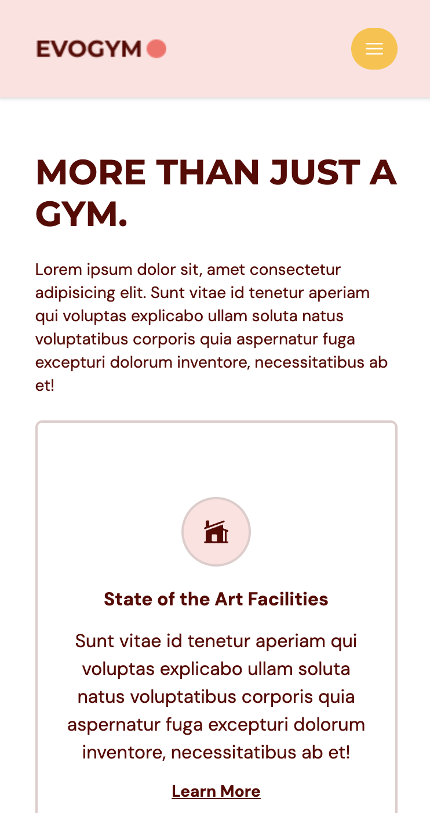
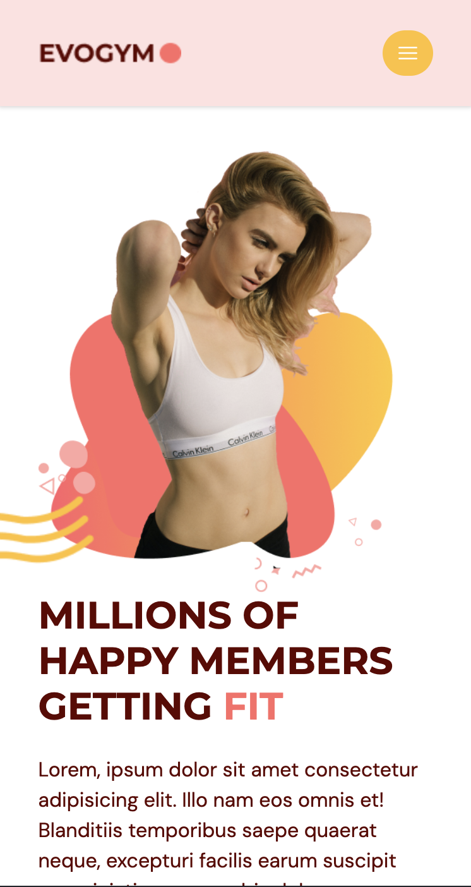

# Evogym

Evogym is a responsive React application built using Vite, React, CSS, HTML5, TypeScript, Tailwind CSS, Framer Motion, and featuring smooth scroll with React anchor links. It includes a transparent navigation bar that changes color on scroll and consists of four main sections: Home, Benefits, Our Classes, and Contact Us with a contact form.

## Visuals

### Desktop







### Mobile





## Features

- **Responsive Design**: The application is designed to adapt to various screen sizes and devices.
- **Transparent Nav Bar**: The navigation bar is transparent by default and changes color upon scrolling.
- **Smooth Scroll**: Smooth scrolling behavior is implemented using React anchor links.
- **Four Sections**:
  - **Home**: The landing page introducing the application.
  - **Benefits**: Highlights the benefits of using Evogym.
  - **Our Classes**: Displays information about the available classes.
  - **Contact Us**: Provides a contact form for users to reach out.

## Technologies Used

- **React**: JavaScript library for building user interfaces.
- **Vite**: A build tool that aims to provide a faster and leaner development experience.
- **HTML5**: Standard markup language for creating web pages.
- **CSS**: Cascading Style Sheets for styling web pages.
- **TypeScript**: A superset of JavaScript that adds optional static types.
- **Tailwind CSS**: Utility-first CSS framework for quickly building custom designs.
- **Framer Motion**: A library for creating animations and gestures in React.
- **Form Submit**: Implementation of form submission for the contact form.
- **Smooth Scroll**: Integration of smooth scrolling behavior using React anchor links.

## Installation

1. Clone the repository:

   ```bash
   git clone https://github.com/your-username/evogym.git

2. Navigate to the project directory:
    ```bash
    cd evogym

3. Install dependencies:
    ```bash
    npm install

## Usage

1. Start the development server:
    ```bash
    npm run dev

2.  Open your browser and navigate to http://localhost:3000 to view the application.

## Contributing

Contributions are welcome! If you'd like to contribute to Evogym, please follow these steps:

1. Fork the repository.
2. Create a new branch (git checkout -b feature/your-feature).
3. Make your changes.
4. Commit your changes (git commit -am 'Add some feature').
5. Push to the branch (git push origin feature/your-feature).
6. Create a new Pull Request.